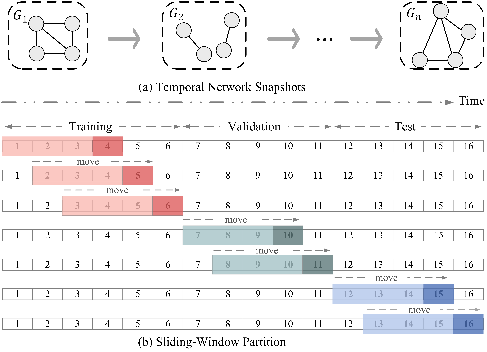

# ProDeL-Prospective-Decoupld-Leaming-for-Future-Node-Imporance-Scoring-in-Dynamic-Networks
ProDeL: Prospective Decoupled Learning for Future Node Importance Scoring in Dynamic Networks

This repository provides the official implementation code for ProDeL, a two-stage prospective decoupled learning framework for predicting future
node importance in dynamic networks.

The code includes the complete pipeline for temporal network preprocessing, sliding-window construction, graph representation learning, two-stage training, evaluation, and visualization.

------------------------------------------------------------------------

Framework Overview

1. Temporal Network Construction and Sliding-Window Partition

The temporal network preprocessing procedure converts continuous interactions into temporal graph snapshots and constructs prediction samples using a sliding-window strategy.

The sliding-window strategy separates historical observations from future prediction targets. Historical snapshots are used as model inputs, while future snapshots serve as prediction targets. This design prevents information leakage and enables rigorous evaluation for prospective node importance prediction.

------------------------------------------------------------------------

2. Overall Two-Stage Learning Framework

The complete model architecture is illustrated below.

The framework adopts a two-stage learning paradigm.

Stage I: Categorization-based Coarse Screening

The first stage performs coarse classification to identify potential future top-k important nodes.

Stage II: Regression-based Refined Scoring

The second stage inherits learned representations and fine-tunes partial upstream parameters to predict continuous node importance scores and generate final rankings.

The framework integrates:

-   Spatial graph encoding
-   Temporal dependency modeling
-   Temporal decay mechanism
-   Node micro-evolution modeling
-   Auxiliary graph reconstruction

------------------------------------------------------------------------

Repository Structure

ProDeL/ | ├── README.md | ├── figures/ | ├── split+window.png | └──
Two_stage.png | ├── main.py | Main experiment entry and hyperparameter
configuration. | ├── train.py | Training pipeline and optimization
procedure. | ├── gnn.py | Graph neural network architectures. | ├──
graph.py | Temporal graph dataset construction. | ├── dataloader.py |
Temporal graph preprocessing and graph loading. | ├── data_processing.py
| Raw interaction preprocessing and sliding-window generation. | ├──
temporal_degree_labels.py | Generation of node importance labels. | ├──
metrics.py | Evaluation metrics and ranking performance calculation. |
└── visulation.py Visualization utilities.

------------------------------------------------------------------------

Data Processing Pipeline

The preprocessing pipeline mainly contains:

data_processing.py

dataloader.py

The procedure includes:

-   Raw interaction loading
-   Temporal snapshot construction
-   Sliding-window partition
-   Graph structure generation
-   Node feature extraction

------------------------------------------------------------------------

Model Architecture

The model consists of three main components.

Spatial Encoder

Extracts topology-aware node representations from temporal graph snapshots.

Temporal Encoder

Captures historical dependencies using temporal modeling mechanisms.

Node Importance Prediction

The learned representations are used for:

-   Future top-k node identification
-   Continuous importance score prediction
-   Node ranking generation

------------------------------------------------------------------------

Training

The training process contains two stages.

Stage I

Objective:

Binary classification loss

The model learns to distinguish future important nodes from other nodes.

Stage II

Objective:

Regression loss + Graph reconstruction loss

The model refines importance scores while preserving structural
information.

------------------------------------------------------------------------

Requirements

Python >= 3.8

Main dependencies:

torch torch-geometric numpy pandas networkx scikit-learn matplotlib tqdm

------------------------------------------------------------------------

Running

After preparing datasets and modifying paths:

python main.py

------------------------------------------------------------------------

License

This repository is released for academic research purposes.

